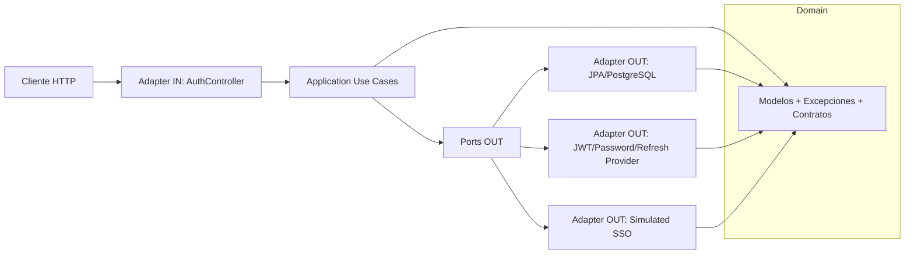
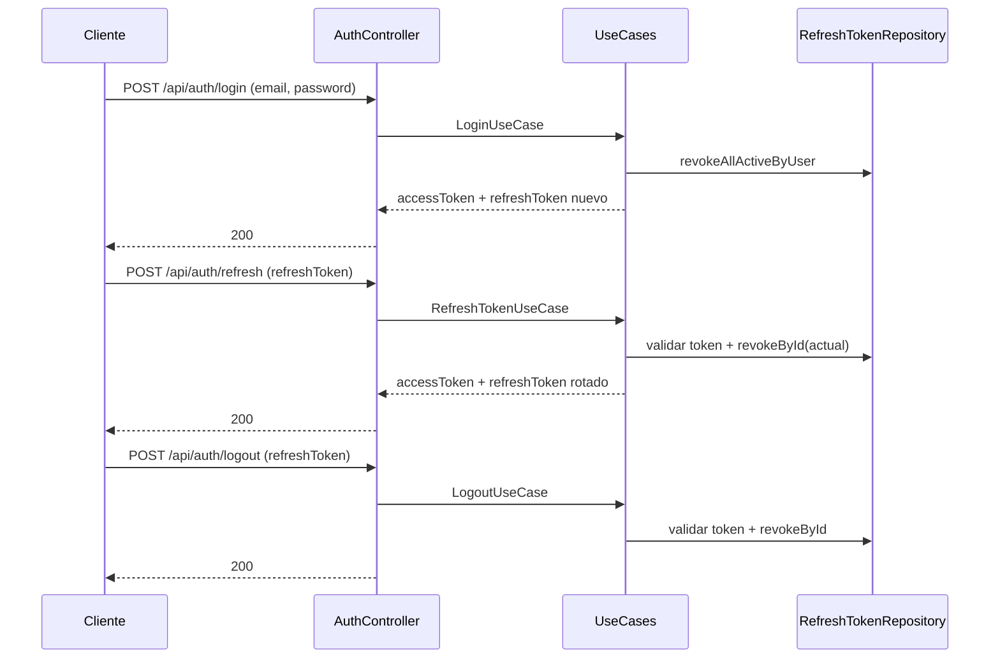
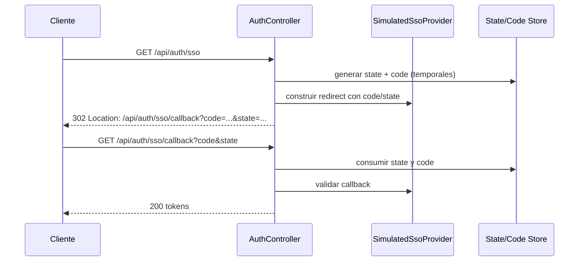
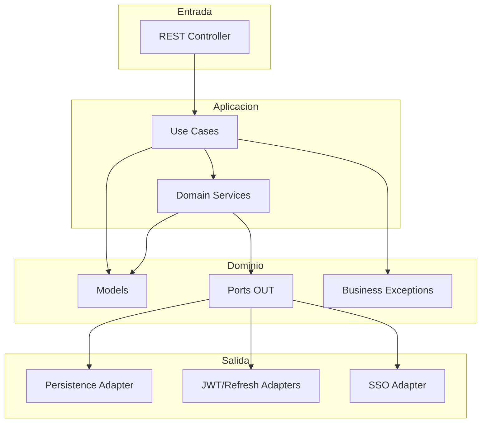

# Entorno Contenerizado con Docker

La aplicación está completamente contenerizada con Docker, lo que evita la necesidad de un despliegue local. No requieres instalar Java, Maven, PostgreSQL ni pgAdmin en tu máquina; con Docker basta para levantar el entorno completo. Esto garantiza un entorno de pruebas reproducible, consistente y rápido, permitiéndote centrarte en validar la funcionalidad sin preocuparte por la configuración del entorno local.

Además, se incluye un archivo con la colección de Postman que contiene todos los endpoints de la API predefinidos. Para realizar pruebas de forma rápida, solo necesitas importar esta colección y los endpoints estarán listos para ser ejecutados, sin necesidad de configurar manualmente cada petición.

APP_ADMIN_EMAIL=admin@econocom.com

APP_ADMIN_PASSWORD=Admin123*

Lo ideal es levantar el proyecto con Docker utilizando el perfil `dev`, y luego revisar la documentación interactiva de Swagger y OpenAPI, donde está completamente documentada la API.

El proyecto también permite ejecutar los tests unitarios y de integración a través de Docker. Los comandos necesarios se encuentran al final de este documento.

No olvide copiar el archivo `.env.example` a `.env` en la raiz del proyecto.

## Authentication Service

Servicio de autenticacion construido con Spring Boot, JWT, rotacion de Refresh Tokens y flujo SSO simulado siguiendo arquitectura hexagonal.

## Introduccion

Este servicio centraliza autenticacion y sesion para clientes backend/frontend. Expone endpoints REST para login local, renovacion de sesion, cierre de sesion y autenticacion por SSO simulado.

## Objetivos

- Proveer autenticacion stateless con Access Token JWT.
- Implementar Refresh Token Rotation con revocacion explicita.
- Simular flujo SSO (state + authorization code) con validaciones anti replay.
- Mantener separacion de capas usando arquitectura hexagonal.
- Exponer y documentar contrato API con OpenAPI 3 + Swagger UI.

## Swagger y OpenAPI

- OpenAPI JSON: `http://localhost:8080/v3/api-docs`
- Swagger UI: `http://localhost:8080/swagger-ui.html`
- Configuracion principal: `src/main/java/com/econocom/authentication/infrastructure/config/openapi/OpenApiConfig.java`
- Controller documentado: `src/main/java/com/econocom/authentication/infrastructure/web/controller/AuthController.java`

### Seguridad en Swagger

Las rutas de documentacion estan permitidas sin JWT en:

- `src/main/java/com/econocom/authentication/infrastructure/security/config/SecurityConfig.java`
- `src/main/java/com/econocom/authentication/infrastructure/security/filter/JwtAuthenticationFilter.java`

## Arquitectura Hexagonal



## Stack tecnologico

- Java 8
- Spring Boot 2.7.18
- Spring Web
- Spring Security
- Spring Data JPA
- PostgreSQL (runtime)
- H2 (tests)
- JWT (`jjwt`)
- MapStruct + Lombok
- OpenAPI/Swagger (`springdoc-openapi-ui` 1.7.0)
- Maven
- Docker + Docker Compose

## Estructura del proyecto

```text
src/main/java/com/econocom/authentication
  application/
    dto/
    service/
    usecase/
    factory/
  domain/
    model/
    port/out/
    exception/
  infrastructure/
    web/controller/
    security/
    persistence/
    external/sso/
    config/
  shared/
    response/
    error/
    exception/
```

## Explicacion de cada paquete

- `application.dto`: contratos de entrada/salida del caso de uso.
- `application.usecase`: orquestacion de reglas por flujo (login, refresh, logout, sso).
- `application.service`: logica reusable de autenticacion (token issuance, validacion refresh, estado sso).
- `application.factory`: creacion de modelos con politicas de expiracion/hash.
- `domain.model`: entidades de negocio puras.
- `domain.port.out`: interfaces que abstraen infraestructura.
- `domain.exception`: errores de negocio tipados.
- `infrastructure.web.controller`: adaptadores REST (`AuthController`).
- `infrastructure.security`: JWT, filtros, configuracion de seguridad y propiedades.
- `infrastructure.persistence`: entidades JPA, repositorios y adapters de persistencia.
- `infrastructure.external.sso`: implementacion de SSO simulado y stores temporales en memoria.
- `infrastructure.config`: wiring tecnico, propiedades y bootstrap admin.
- `shared.response`: envelope API comun (`ApiResponse`).
- `shared.error`: catalogo de codigos funcionales (`AUTH-xxx`).
- `shared.exception`: handler global de excepciones.

## Flujo de autenticacion

### 1) Login -> Refresh -> Logout



### 2) SSO simulado



## JWT

- Se emite en login, refresh y callback SSO.
- Tipo de token de salida: `Bearer`.
- Expiracion configurable: `security.jwt.expiration`.
- Firma HMAC con secreto configurable: `security.jwt.secret`.

## Refresh Token Rotation

Implementacion principal:

- `src/main/java/com/econocom/authentication/application/usecase/auth/LoginUseCase.java`
- `src/main/java/com/econocom/authentication/application/usecase/auth/RefreshTokenUseCase.java`
- `src/main/java/com/econocom/authentication/application/service/auth/RefreshTokenValidationService.java`

Reglas:

1. En login/SSO se revocan tokens activos previos del usuario.
2. En refresh se valida token actual.
3. Si es valido, se revoca inmediatamente (`revokeById`) y se emite un token nuevo.
4. El refresh token se almacena hasheado (BCrypt), nunca en claro.

## Simulated SSO

El proveedor simulado:

- Genera una URL de callback local con `code` y `state`.
- Valida callback y asocia email admin configurado.
- Usa almacenamiento temporal en memoria con expiracion.

Archivos clave:

- `src/main/java/com/econocom/authentication/infrastructure/external/sso/SimulatedSsoProviderAdapter.java`
- `src/main/java/com/econocom/authentication/application/service/auth/SsoStateService.java`
- `src/main/java/com/econocom/authentication/application/service/auth/AuthorizationCodeService.java`

## Gestion de errores

- Handler global: `src/main/java/com/econocom/authentication/shared/exception/GlobalExceptionHandler.java`
- Catalogo: `src/main/java/com/econocom/authentication/shared/error/ErrorCode.java`
- Envelope uniforme: `ApiResponse<T>`

Codigos funcionales principales:

- `AUTH-001` User not found
- `AUTH-002` Invalid credentials
- `AUTH-004` Invalid refresh token
- `AUTH-005` Refresh token revoked
- `AUTH-006` Refresh token not found
- `AUTH-007` Refresh token expired
- `AUTH-008` Invalid SSO state
- `AUTH-009` Invalid SSO callback

## Endpoints documentados

| Metodo | Endpoint | Descripcion | Auth requerida |
|---|---|---|---|
| POST | `/api/auth/login` | Login por email/password | No |
| POST | `/api/auth/refresh` | Rotacion de refresh token | No |
| POST | `/api/auth/logout` | Revocacion de refresh token | No |
| GET | `/api/auth/sso` | Inicio de flujo SSO simulado (redirect) | No |
| GET | `/api/auth/sso/callback` | Callback SSO simulado | No |
| GET | `/v3/api-docs` | Especificacion OpenAPI | No |
| GET | `/swagger-ui.html` | Interfaz Swagger UI | No |

## Ejemplos de peticiones y respuestas (JSON)

### Login exitoso

**Request**

```json
{
  "email": "test-admin@local",
  "password": "test-admin-password"
}
```

**Response 200**

```json
{
  "success": true,
  "status": 200,
  "message": "Login successful.",
  "data": {
    "accessToken": "eyJhbGciOiJIUzI1NiJ9...",
    "refreshToken": "f47ac10b-58cc-4372-a567-0e02b2c3d479.XYZ_SECRET",
    "tokenType": "Bearer",
    "expiresIn": 900000
  },
  "timestamp": "2026-07-13T10:15:30"
}
```

### Login con credenciales invalidas

**Response 401**

```json
{
  "success": false,
  "status": 401,
  "code": "AUTH-002",
  "message": "Invalid credentials.",
  "timestamp": "2026-07-13T10:16:10"
}
```

### Refresh invalido

**Request**

```json
{
  "refreshToken": "not-a-valid-refresh-token"
}
```

**Response 401**

```json
{
  "success": false,
  "status": 401,
  "code": "AUTH-004",
  "message": "Invalid refresh token.",
  "timestamp": "2026-07-13T10:17:00"
}
```

## Variables de entorno

| Variable | Uso |
|---|---|
| `POSTGRES_DB` | Nombre de base de datos PostgreSQL |
| `POSTGRES_USER` | Usuario de PostgreSQL |
| `POSTGRES_PASSWORD` | Password de PostgreSQL |
| `JWT_SECRET` | Secreto HS256 para firma JWT |
| `APP_ADMIN_EMAIL` | Email del usuario admin bootstrap |
| `APP_ADMIN_PASSWORD` | Password del usuario admin bootstrap |
| `SPRING_PROFILES_ACTIVE` | Perfil activo (`dev`, `test`) |

## Docker

### Dockerfile base (`Dockerfile`)

- Build multi stage: compila jar con Maven y ejecuta en JRE 8.
- Expone puerto `8080`.

### Dockerfile de desarrollo (`Dockerfile.dev`)

- Imagen Maven con dependencias precargadas.
- Pensado para montar codigo y ejecutar `mvn spring-boot:run`.

## Docker Compose

### Base (`docker-compose.yml`)

- `postgres` (16-alpine)
- `pgadmin`
- `authentication-service`

### Dev (`docker-compose.dev.yml`)

- Override para `authentication-service` en modo desarrollo.
- Monta codigo local y cache Maven.

### Test (`docker-compose.test.yml`)

- Servicio preparado para ejecutar tests con perfil `test`.
- Usa volumen de cache Maven dedicado (`maven_cache_test`).

## Ejecucion con Docker

```powershell
docker compose -f docker-compose.yml up --build
```

### Modo desarrollo

```powershell
docker compose -f docker-compose.yml -f docker-compose.dev.yml up --build
```

### Ejecutar tests en contenedor

```powershell
docker compose -f docker-compose.yml -f docker-compose.test.yml run --rm authentication-service mvn test
```

## Ejecucion de tests

```powershell
./mvnw test
```

## Estrategia de testing

- Unit tests para servicios y casos de uso (`application/service`, `application/usecase`).
- Integration tests con `MockMvc` para contrato HTTP y persistencia.
- Perfil `test` con H2 en memoria (`src/test/resources/application-test.yml`).

## Decisiones de diseño

- Arquitectura hexagonal para aislar dominio de frameworks.
- Tokens stateless (JWT) para rendimiento en autenticacion de requests.
- Refresh token opaco + hash BCrypt para reducir riesgo de exfiltracion.
- Rotacion y revocacion para limitar ventana de reutilizacion.
- SSO simulado desacoplado por puertos para reemplazo futuro por proveedor real.

## Consideraciones de seguridad

- Secreto JWT minimo de 32 caracteres (HS256).
- Revocacion de refresh tokens en login, refresh y logout.
- Validacion estricta de `state` y `authorization code` con expiracion.
- Hash de refresh token en base de datos.
- Endpoint protegido por defecto en security chain.

## Posibles mejoras

1. Integrar proveedor OIDC real (Keycloak/Auth0/Azure AD).
2. Agregar rotacion de claves JWT (kid + JWKS).
3. Implementar auditoria de eventos de autenticacion.
4. Agregar rate limiting y proteccion anti brute force.
5. Incluir refresh token binding (device/session fingerprint).
6. Publicar coleccion Postman y contrato OpenAPI versionado por release.

## Conclusiones

El servicio cumple un flujo completo de autenticacion con enfoque pragmatico: JWT para acceso rapido, refresh token con rotacion/revocacion para control de sesion y SSO simulado para validar la orquestacion OAuth-like. La combinacion de arquitectura hexagonal, manejo uniforme de errores y documentacion OpenAPI reduce acoplamiento y mejora mantenibilidad.

## Diagrama adicional de arquitectura hexagonal



